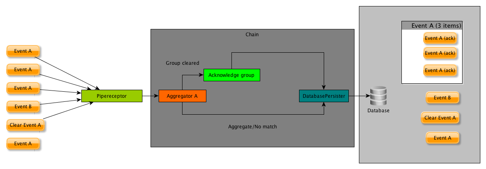

.. _about_label:

*************
What is EDBC?
*************

EDBC (EventDB Correlator) is an agent for `EventDB <https://www.netways.org/projects/eventdb/wiki>`, our tool for integrating passive monitoring (like snmp, syslog or mail events) into icinga (or similar) monioring enviromnents. 
EDBC offers a lot of features that are required to cover advanced monitoring use cases:

* Pipe based event collection with the possibility to define your own input formats 
* Basic support for acting as a snmp_agent by parsing and using SNMPTT mib files
* Aggregation of events based on advanced matcher patterns 
* Clearance of aggregations via clear matchers or by timeout
* Extensible and easy to understand event processor mechanismn for writing your own processors

Basic concept
=============

EDBC consists of three elements:

* Receptors : These are the inputs of edbc. For example, the PipeReceptor creates a pipe and listens for events on this pipe
* Processors: Processors take your events and perform logic on them. For example a AggregationProcessor takes your event, looks if it fits into a definition of an aggregation group and adds them to existing groups (or creates a new one) if so. Or a DatabasePersister takes your event and writes it into a database.  
* Chains: Chains glue Processors and receptors together. For example, a simple chain (as shown in the image below) takes an event from a pipe, directs it to the aggregationprocessor and - if the event clears an aggregation - calls a ModifierProcessor that triggers an acknowledgement.

This is indeed a very simple example, you can create more complex chains, customize your messages or even create your own processors.

