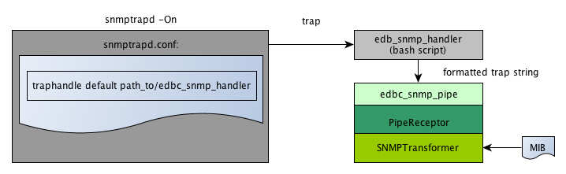

Component Reference
===================

.. _transformer-ref:

Transformer *(class: transformer)*
----------------------------------

Transformers take the raw event input (mostly strings) and convert them into normalized events  

.. _string-transformer-ref:

StringTransformer *(type: string)*
``````````````````````````````````

String transformers take raw string input and convert them events using a regular expression or fixed settings

#. **Example**::
	
	[rsyslog_reader]
	class:transformer
	type:string
	format:^(?P<CREATED>[a-zA-Z]{2,3} \d\d \d\d:\d\d:\d\d) (?P<HOST>[^ ]+)( (?P<PROGRAM>[^:]+):)? (?P<MESSAGE>.*)$
	fixed: Priority=1,Facility=1

#. **Parameters**

	* **defaultmessage**: If no message is defined, this message (normally 'No message given') is used
	* **format**: A regular expression extracting the important event properties of an event with named matching groups. You can define any property you want, but persisted properties are per default:
		* MESSAGE 
		* HOST    
		* HOST_ADDRESS
		* PRIORITY
		* FACILITY
		* PROGRAM
		* CREATED 
		* MODIFIED
	* **fixed**: A comma seperated key=value list defining which properties are set as constants


.. _snmp-transformer-ref:

SNMPTransformer *(type: snmp)*
``````````````````````````````

SNMP Transformer are able to read MIB files produced by `snmpttconvertmib <http://snmptt.sourceforge.net/docs/snmpttconvertmib.shtml>`_ and parse their EVENT and FORMAT directives. It expects snmptraps to be received with numerical OIDs.

#. **Example**::
	
	[snmp_reader]
	class: transformer
	type:  snmp
	mib_dir: /usr/share/snmptt/mibs
	fixed: Priority=3,Facility=5,program=snmp

#. **Parameters**
	
	* **mib_dir**: The directory to load the mib files snmpttconvertmib created. This is a required field
	* **trap_format**: **Only define this if you create a modified trap handler** Define how to parse the string data received from the traphandler
	* **prioritymap**: Define a comma seperated severity=priority mapping. The event's severity needn't to match the whole string, if it only begins with the string defined in your map it will be mapped to the priority, too. Per default the map looks like this:
		* emer = 0
		* aler = 1
		* crit = 2
		* majo = 2
		* erro = 3
		* warn = 4
		* noti = 5
		* mino = 5
		* ok   = 5
		* info = 6
		* norm = 6
		* debu = 7 

 
	* **fixed**: A comma seperated key=value list defining which properties are set as constants


.. _receptors-ref:

Receptors *(class:receptor)*
-----------------------------

Receptors are the components that receive raw events and therefore the interface of edbc to the world. They are usually coupled with a :ref:`transformer-ref` and at the start of every event chain.


.. _pipereceptor-ref:

Pipe Receptor *(type:pipe)*
```````````````````````````

A pipe receptor opens a pipe upon creation and receives events 

#. **Example**::

	[pipe]
	class:receptor
	type:pipe
	path:/tmp/edbc.pipe
	format:@simple_pipe_in

#. **Parameters**

	* **mod** : The permission mask which will be used for the created pipe (default: 0666)
	* **owner** : The owner of the pipe (default: The process owner)
	* **group** : The group of the pipe (default: The process owner's group)
	* **path** : An existing, writable path to create the pipe at (default /usr/local/var/edbc.pipe)
	* **bufferSize** : The input buffer of this receptor (default 2KB)
	* **format** : (required) An :ref:`transformer-ref` instance that will be used to format the raw event data to a normalized event
	* **source_type**: The source name given to the event (default: syslog)


.. _snmpreceptor-ref:

SNMP Receptor *(type:snmp)*
```````````````````````````

SNMP Receptors are basically pipe receptors which receive snmp traps from a snmp handler.



The SNMP Receptors opens a pipe where it listens on and creates a bash script which can be set as a traphandler in your snmptrapd.conf. The bash script just forwards the trap in a string format to the pipe, which then transforms it to an event with an :ref:`snmp-transformer-ref`.

#. **Example**::

	[snmp]
	class:receptor
	type:snmp
	handler:/usr/local/edbc/var/edbc_snmp_handler
	format:@snmp_reader

#. **Parameters**

	* **mod** : The permission mask which will be used for the created pipe and snmp handler (default: 0774)
	* **owner** : The owner of the pipe and snmp trap handler (default: The process owner)
	* **group** : The group of the pipe and snmp trap handler (default: The process owner's group)
	* **path** : An existing, writable path to create the pipe at (default /usr/local/var/edbc.pipe)
	* **bufferSize** : The input buffer of this receptor (default 2KB)
	* **format** : (required) An :ref:`transformer-ref` instance that will be used to format the raw event data to a normalized event
	* **source_type**: The source name given to the event (default: snmp)
	* **handler** : The location to write the handler script to (default: /usr/local/var/edb_traphandler)
	* **handler_tpl** : The template to use for the handler (default : %INSTALL_PATH%/libexec/snmp_handler_template)
	


.. _processor-ref:

Processors *(class:processor)*:
-------------------------------

Processors are components that perform arbitary actions on your events, like altering them, aggergating them or writing them to a database. 

.. _aggregationprocessor-ref:

Aggregation Processor *(type:aggregation)*
``````````````````````````````````````````

Aggregators try to match events by using the :ref:`matcher-syn` and groups them. The usage is described in detail under :ref:`aggregator-example`.

#. **Example**::

	[example-aggregator]
	class: processor
	type:  aggregation
	matcher: message REGEXP 'The server (?P<HOSTNAME>\w+) just went down. Errorcode (?P<CODE>\d+)' OR  message REGEXP 'Server (?P<HOSTNAME>\w+) is up again \(Error (?P<CODE>\d+)\)' 
	aggregateMessage: Server $HOSTNAME is down (Code : $CODE) ($_COUNT events)
	clear: message REGEXP 'Server \w+ is up again \(Error \d+\)' 
	datasource: @mysql

#. **Parameters**
	
	* **matcher**: An :ref:`matcher-syn` defining every message (clear and aggregate message) that this aggregator processes. Matching groups are used to identify the group.
	* **aggregatemessage**: The message to use for the group. Can reference matcher groups by $NAME tokens and event properties by #PROPERTY tokens. $_COUNT is a special variable resolved by the frontend
	* **clear**: A :ref:`matcher-syn` triggering a clear message. This is used **after** the matcher field is processed, so if the matcher doesn't contain the clear message, this is never processed
	* **datasource**: A :ref:`datasource-ref` that is required to process aggregation groups
	* **maxdelay**: The aggregation will be automatically cleared when a group does not get a new event for maxdelay seconds (default: 24 hours)


#. **Return codes**
	
	* **AGGR**: Returned when an event is added to an *existing* aggregation group
	* **NEW** : Returned when an event creates a new aggregation group
	* **CLEAR**: Returned when an event clears an aggregation group because of the clear matcher (maxdelay doesn't cause this)
	* **PASS** : Returned when the matcher doesn't match the event


.. _commandprocessor-ref:

Command Processor *(type:command)*
``````````````````````````````````

This processor writes a "[TIME] MESSAGE" string into a defined pipe and can be used e.g. to trigger external commands in your monitoring environment.

#. **Example**::

	[example-command]
	class: processor
	type: command
	format: SCHEDULE_FORCED_HOST_CHECK;#HOST;#CREATED
	pipe: /usr/local/icinga-web/var/rw/icinga.cmd
	
#. **Parameters**

	* **matcher**: A :ref:`matcher-syn` that determines if the processor is called 
	* **format** : The format of the message to fire, ($NAME is replaced with matcher tokens, #NAME with event fields)
	* **pipe**   : The pipe to write the message to

#. **Return codes**
	
	* **PASS** : The matcher didn't match the event or there was a setup error (no format or pipe)
	* **OK**   : Command has been send to the pipe
	* **FAIL** : The command couldn't be send for some reason


.. _modifierprocessor-ref:

Modifier Process *(type:modifier)*
``````````````````````````````````

A processor that acts upon events or event groups and modifies their properties. See :ref:`mod-processor` for an in depth explanation 

#. **Example**::
	[example-acknowledger]
	class: processor
	type: modifier
	target: group
	acknowledge: true
	datasource: @mysql

#. **Parameters**
	
	* **matcher**: A :ref:`matcher-syn` that determines if the processor is called 
	* **overwrite**: static overwrites in key1=value1;key2=value2;... format 
	* **acknowledge**: Set to true if you want to acknowledge the event/group
	* **target**: group or event, defines if the modifier acts only on the event or the whole group
	* **datasource**: if target is group you must use define a datasource here 

#. **Return codes**
	
	* **PASS** : The matcher didn't match the event
	* **OK**   : The event has been processed


.. _datasource-ref:

Datasources *(class:datasource)*
--------------------------------

Datasources are a subset of processors that can write or read to/from a persistent datasource. 


.. _mysql-datasource-ref:

MySQL Datasource *(type:mysql)*
```````````````````````````````

A connector writing to mysql using MySQLdb

#. **Example**::

	[mysql]
	class: 		datasource
	type:		mysql
	host: 		localhost
	port: 		3306
	table: 		event
	database:       eventdb	
	user:		eventdb
	password: 	eventdb

#. **Parameters**
	
	* **host**: The host the database is located
	* **port**: The port of the database
	* **table** : The table of eventdb (it's best to use event here)
	* **database**: The name of the database this source works onb
	* **user** : The user credential
	* **password** : The password of the db user
	* **flush_interval** : Interval in ms which is used to flush the internal db cache (100ms and don't change it if you don't need to) after changes
	* **spool**: A datasource to use for spooling when the db is down or errors occur (normally a :ref:`spool-datasource-ref`)
	* **poolsize**: The size of the connection pool (10 connections per default)

#. **Return codes**
	
	* **OK**: Insert succeeded
	* **FAIL**: Insert failed for some reason
	* **SPOOL**: No working connection available, written to spool datasource


.. _spool-datasource-ref:
	
Spool Datasource *(type:spool)*
```````````````````````````````

A datasource that buffers queries when a connection is not available. Can write to file or reside queries in memory.

.. note:: This datasource can only be used as the spool property of a datasource, not directly in chains

#. **Example**::

	[spooler]
	class: 	datasource
	type:	spool
	buffer_size: 100
	spool_dir: /tmp/spool.edbc

#. **Parameters**

	* **spool_filename**: The file name to use for the spool file (not the path, default edbc.spool)
	* **spool_dir**: If given, the spool buffer will be flushed to a file when exceeding buffer_size. Also other datasources using spooling can read the spool file on startup
	* **buffer_size**: How many events should reside in memory when being spooled. If you don't shutdown edbc correctly (like killing it without the -QUIT or -INT signal) these events will be lost. When no spool dir is given, the first events in the spool will be thrown away if more events than buffer size are written. Otherwise, the buffer is written to the spool file
