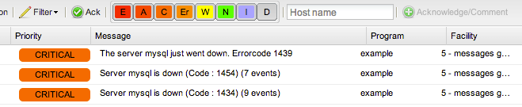
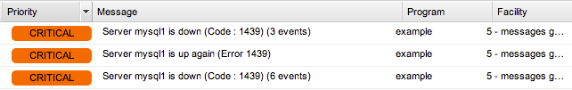
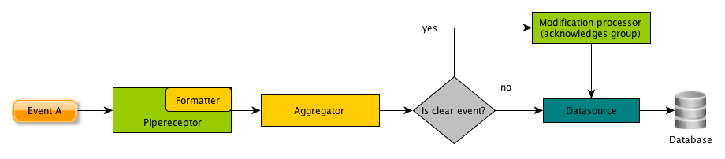

.. _Configuration:

*************
Configuration
*************

.. _basecfg:

Basic configuration syntax
--------------------------

.. note:: This section intends to give you a good understanding how edbc works. Especially step 2 and step 3 are way more comprehensive
          than normally needed and simplified in the last step. If you just need a quick overview, refer to the quickstart guide.


A component always starts with the id of the object in brackets, followed by a set of key: value pairs.
For example the database configuration found in your etc/conf.d/database.cfg looks like this::

	[mysql]
	class: 		datasource
	type:		mysql
	host: 		localhost
	port: 		3306
	table: 		event
	database:       eventdb	
	user:		eventdb
	password: 	eventdb

Let's look at this configuration more in depth:

* \[mysql\] only defines that this component has the id mysql - and can be referenced with @mysql in other components (we'll see this later)
* class: datasource defines the type of the component. Possible types are:
	* datasource: 	A component which can execute SQL commands and is able to persist data
	* processor: 	A generic processor that performs arbitary actions on an event
	* receptor: 	A component which is able to receive arbitary events and normalizes themfor further processing
	* transformer:  A component that defines how the raw event data from a receptor is transformed to normalized events
* type: Defines the concrete component type to use
* template: Optional definition of a parent configuration which is used as the base configuration for the new template. *class* and *type* can be omitted when using this definition

Any further settings are component specific.

.. Note:: If you're a developer and curious: The class/type definition is used to determine the class name of the objects: %type%_%class% 

Step by step: 1. The most minimal setup
---------------------------------------

In the first place, the configuration looks more complicated then it is, so let's start by setting up a simple chain that just receives messages through a pipe and writes them to the EventDB database. 

The following image shows how our chaining will look like:

.. image:: res/smallsteps_chain1.png 


1. General setup
````````````````
* Make sure your etc/conf.d/database.cfg has the correct credentials set
* Create a file called example_config.cfg in your etc/conf.d/database.cfg. We'll define every component we need here

2. Setting up a receptor
````````````````````````

The first component we have to care for is the receptor. As we want our events to be received on a pipe, we use a :ref:`pipereceptor-ref` that creates and listens at the pipe */usr/local/var/edbc_example.pipe*. So let's add it to our example_config.cfg and give it the id *example-pipe* ::

	[example-pipe]
	class: receptor
	type: pipe
	path: /usr/local/var/edbc_example.pipe

One important thing is missing here: Only receptors must define how a :ref:`event_format` is created. In :ref:`basecfg`, we already heard that components called *transformers* are responsible for this. In this case you want a :ref:`string-transformer-ref` to format your message input, so we create one, called *simple-transformer* ::
	
	[simple-transformer]
	class: transformer
	type:  string
	format: (?P<PRIORITY>\d+) (?P<FACILITY>\d+) (?P<MESSAGE>.*)$
	fixed: program=example

Here, two directives are important:
* format: This is a python regular expression that maps parts of the message to event descriptors. A message with the format '5 4 A testmessage' would create an event with priority of 5, facility 4 and message text 'A testmessage'
* fixed: a comma separated key=value list defining event parameters that are constant. Here our event will always have the program 'example'.
.. note:: (?P<NAME>...) are named matching groups in python, see `Pythons re documentation <http://docs.python.org/2/library/re.html>`_ for additional information

Now we only need to tell our receptor that it uses the simple-transformer for parsing events. This is done by adding a format property that contains the simple-transformer instance. Instances always have the prefix @, so our example_config.cfg now looks like this::
	
	[example-pipe]
	class: receptor
	type:  pipe
	path: /usr/local/var/edbc_example.pipe
	format: @simple-transformer


	[simple-transformer]
	class: transformer
	type:  string
	format: (?P<PRIORITY>\d+) (?P<FACILITY>\d+) (?P<MESSAGE>.*)$
	fixed: program=example
 
That's it, now we can proceed to the last step

3. Creating a chain 
```````````````````

No we only have to create a simple chain that takes the events from our *example-pipe* Receptor and writes them to our database. For this, simple create a example_config.chain file under etc/chains/. 

We'll call our chain *example-chain*, so like always, we're starting with::
	
	[example-chain]

Now we have to define the input of the chain by adding an *in* directive referencing the example-pipe instance::

	[example-chain]
	in: @example-pipe 

And now, we add our only chain component, the datasource by adding a *to* directive pointing to our datasource::

	[example-chain]
	in: @example-pipe 
	to_1: @mysql

.. note:: The number after to\_ is mandatory and defines the position in the chain in which the processor is executed. We see later that we can also use the return code of a chain component as a condition for other chain components. 

4. Test it
``````````

Now we can start edbc::
	
	/usr/local/edbc/bin/edbc

If everything went fine, there should be a pipe at /usr/local/var/edbc_example.pipe.

Let's fire a test event to see if it works::
	
	# echo "5 4 testmessage" > /usr/local/var/edbc_example.pipe 

We now should have an event in our database with priority 5, facility 4 and testmessage as the message::

	# mysql -u eventdb -p eventdb 
	mysql> SELECT facility,priority,message,program FROM event ORDER BY id desc limit 1; 
	+----------+----------+-------------+---------+
	| facility | priority | message     | program |
	+----------+----------+-------------+---------+
	|        4 |        5 | testmessage | example |
	+----------+----------+-------------+---------+
	1 row in set (0.00 sec)


.. _aggregator-example:

Step by step: 2. Adding aggregators
-----------------------------------

Until now, there's nothing special about our setup, we just accept events and write them to the database. We will now add some logic. Let's say we want to take events with a message like 'The server ... just went down. Errorcode xyz' and aggregate them if the server name and the errorcode is the same, so we have for example 'Server mysql1-ad is down (Code : 1152) (10 Events) in our frontend. This can be accomplished with the aggregator processor, which we have to add to our chain. 

So our old chain:

.. image:: res/smallsteps_chain1.png 

Will at the end of this chapter look like this:

.. image:: res/smallsteps_chain2.png 

1. Define the aggregation processor component
`````````````````````````````````````````````

First we will again look in our example_config.cfg and add an aggregation processor with the id example-aggregator::

	[example-aggregator]
	class: processor
	type:  aggregator

In order to recognize if a message should be aggregated, we have to define a matcher directive::
	
	[example-aggregator]
	class: processor
	type:  aggregator
	matcher: message REGEXP 'The server (?P<HOSTNAME>\w+) just went down. Errorcode (?P<CODE>\d+)'

The matched groups are, together with the id, used to create a group identifier. If an event starts a new aggregation group, it becomes a group leader. Every event with the same group identifier will be added to the aggregation group of the group leader.

Now we want to add an aggregated message. This is the message that will be written to the group leaders *alternative_message* field in the database and can reference fields from the matcher::

	[example-aggregator]
	class: processor
	type:  aggregation
	matcher: message REGEXP 'The server (?P<HOSTNAME>\w+) just went down. Errorcode (?P<CODE>\d+)'
	aggregateMessage: 'Server $HOSTNAME is down (Code : $CODE) ($_COUNT events)

.. note:: $NAME resolves to the matcher field called name, #XYZ resolves to the event property XYZ. So #message would resolve to the (group leaders) message, $_COUNT is just a hint for the eventdb frontend and will be replaced with the actual group count
 
Additionally, we need to tell our aggregator from which datasource it can gather group information, this is normally the database you're writing to::
	
	[example-aggregator]
	class: processor
	type:  aggregation
	matcher: message REGEXP 'The server (?P<HOSTNAME>\w+) just went down. Errorcode (?P<CODE>\d+)'
	aggregateMessage: Server $HOSTNAME is down (Code : $CODE) ($_COUNT events)
	datasource: @mysql


.. note:: You can also add a maxDelay directive to the aggregator, so a new aggregation group will be created after maxDelay seconds passed without a matching event.

2. Update the chain
```````````````````

Our chain now only needs the aggregator being added between the input and the database::

	[example-chain]
	in: @example-pipe 
	to_1: @example-aggregator
	to_2: @mysql

3. Test it
``````````

To test it, we can write a few similar messages to the pipe, like::

	# echo '2 5 The server mysql just went down. Errorcode 1434' >> /usr/local/var/edbc_example.pipe
	# echo '2 5 The server mysql just went down. Errorcode 1434' >> /usr/local/var/edbc_example.pipe
	.,,
	# echo '2 5 The server mysql just went down. Errorcode 1434' >> /usr/local/var/edbc_example.pipe

And a few messaages with a different errorcode::
	
	# echo '2 5 The server mysql just went down. Errorcode 1454' >> /usr/local/var/edbc_example.pipe
	...
	# echo '2 5 The server mysql just went down. Errorcode 1434' >> /usr/local/var/edbc_example.pipe
	# echo '2 5 The server mysql just went down. Errorcode 1439' >> /usr/local/var/edbc_example.pipe

In the frontend, this should result in a resultset like this:



.. _clear-message-example:

4. One step further:  Adding a clear message
````````````````````````````````````````````

Sometimes, you receive a clear message for previous events which tell you that the problem is fixed now. After receiveing such an event, continuing to summarize events doesn't make sense, as new events belong to a new problem. To realize this, our aggregation processor can be extended with a clear field

First we add the clear message::

	[example-aggregator]
	class: processor
	type:  aggregation
	matcher: message REGEXP 'The server (?P<HOSTNAME>\w+) just went down. Errorcode (?P<CODE>\d+)'
	aggregateMessage: 'Server $HOSTNAME is down (Code : $CODE) ($_COUNT events)
	datasource: @mysql
	clear: message REGEXP 'Server \w+ is up again (Error \d+)' 

.. warning:: This example won't work! Read on. 

There's one thing you have to do now: As the matcher defines which group the event belongs to and the clear message should only clear this specific group, you have to add the clear message to the matcher (sounds complicated, but is simple)::

	[example-aggregator]
	class: processor
	type:  aggregation
	matcher: message REGEXP 'The server (?P<HOSTNAME>\w+) just went down. Errorcode (?P<CODE>\d+)' or message REGEXP 'Server (?P<HOSTNAME>\w+) is up again \(Error (?P<CODE>\d+)\)'
	aggregateMessage: Server $HOSTNAME is down (Code : $CODE) ($_COUNT events)
	datasource: @mysql
	clear: message REGEXP 'Server \w+ is up again \(Error \d+\)' 


Now the clear message will be processed by the aggregator and the group will be cleared::

	# echo '2 5 The server mysql1 just went down. Errorcode 1439' >> /usr/local/var/edbc_example.pipe 
	...
	# echo '2 5 The server mysql1 just went down. Errorcode 1439' >> /usr/local/var/edbc_example.pipe 
	
	# echo '2 5 Server mysql1 is up again (Error 1439)' >> /usr/local/var/edbc_example.pipe
	
	# echo '2 5 The server mysql1 just went down. Errorcode 1439' >> /usr/local/var/edbc_example.pipe 
	# echo '2 5 The server mysql1 just went down. Errorcode 1439' >> /usr/local/var/edbc_example.pipe 
	# echo '2 5 The server mysql1 just went down. Errorcode 1439' >> /usr/local/var/edbc_example.pipe 

The result in the fronten looks like this:



Step by step: 3. Conditional processing - Autoacknowledge events
----------------------------------------------------------------

In the last part of this ste by step guide, we show how to execute processors only if a previous processor finished
with a certain return code. A common use case of this is to acknowledge events after a clear event comes. 

Our chain will now get an additional component, called modification processor, that only processes the event if a group has been cleared. 




.. _mod-processor:

1. Defining a modification processor
````````````````````````````````````

We'll continue where we left in step :ref:`clear-message-example`. When we clear our group, all previous 'server down' events should be automatically acknowledged. For this, we need to define a :ref:`modifierprocessor-ref` with the id 'example-acknowledger' in our example-config.cfg::
	
	[example-acknowledger]
	class: processor
	type: modifier

A modifier can have two targets:

* *group* defines that this modifier acts upon the whole group. If you use target: group you always need to add a datasource, too (like in the aggregator)
* *event* defines that this modifier only defines the event that it currently processes.

We want our whole group to be cleared, so we use target: group and add our mysql datasource::

	[example-acknowledger]
	class: processor
	type: modifier
	target: group
	datasource: @mysql
	
And now we define which modifications will be performed upon the group. This can be done with two directives:

* overwrites: is a key=value;key=value string that defines which fields will be overwritten (e.g. priority=1;facility=9 would overwrite the priority and the facility of the event)
* acknowledge: This is the same like ack=1 in the overwrite field and triggers an acknowledge of the whole group (or event, depending on your target setting)

We only want to acknowledge our aggregated group, so we add a *acknowledge: true* setting::
	[example-acknowledger]
	class: processor
	type: modifier
	target: group
	datasource: @mysql
	acknowledge: true

That's it, our acknowledger is ready and we can update our chain

.. note:: A default installation already has acknowledge_event and acknowledge_group processors defined that you can use, but we defined it here to see how it works

2. Updating the chain
`````````````````````

Let's recall our chain::

	[example-chain]
	in: @example-pipe 
	to_1: @example-aggregator
	to_2: @mysql

You see that every event is being processed by every event in our chain. We defined components by to\_ followed by an arbitary number, while lower numbers are executed first. In order to direct our event only if a certain condition applies, we have to extend the syntax a bit: You can define a processor target with to\_ followed by a set of conditions, followed by a number that determines the position.

Conditions are in the syntax *%processor_number%*\[*%return value%*\]. Every processor returns a string like 'OK', 'PASS', etc. 
We're interested in our aggregation processor, which returns one of the following values:

* **PASS**: The matcher didn't match the current event, it is not processed by the aggregator
* **AGGR**: The event is added to an existing group 
* **NEW** : The event started a new aggregation group, future matching events will be added to this group
* **CLEAR**: The 'clear' matcher matched this event and cleared an aggregation group 

Our aggregator has the position 1 and we now want the event to be directed to the modification processor we created in :ref:`mod-processor` only if the aggregator return CLEAR. so our condition looks like this::

	1[CLEAR]

Now we add our conditional processor to the example chain and end up with the following definition::

	[example-chain]
	in: 		@example-pipe 
	to_1:		@example-aggregator
	to_1[CLEAR]_2: 	@example-acknowledger
	to_3: 		@mysql


3. Test it
``````````

Using the same test as in the last section, our EventDB frontend looks like this:

.. image:: res/ui3_ack.png

As you see, the group has been acknowledged after the clear event


Step by step: 4. Simplify it
-----------------------------

Currently, the setup covers most needs, but is rather complicated. If you want to change aggregators, you need a lot of knowledge and modify a lot of files. Also the autoacknwoledge
is very complicated for the rather simple action you want to perform.
EDBC has a few shortcuts for the usual setups:

1. Directly acknowledge in the aggregator
`````````````````````````````````````````

The whole Step 3 can be skipped when you add the acknowledge_on_clear directive your aggregation processor::

	[example-aggregator]
	class: processor
	type:  aggregation
	matcher: message REGEXP 'The server (?P<HOSTNAME>\w+) just went down. Errorcode (?P<CODE>\d+)' or message REGEXP 'Server (?P<HOSTNAME>\w+) is up again \(Error (?P<CODE>\d+)\)'
	acknowledge_on_clear: True,
	aggregateMessage: Server $HOSTNAME is down (Code : $CODE) ($_COUNT events)
	datasource: @mysql
	clear: message REGEXP 'Server \w+ is up again \(Error \d+\)'

You can then remve the example-acknowledger definition and cut down your chain to::

    [example-chain]
	in: @example-pipe
	to_1: @example-aggregator
	to_2: @mysql

2. Use the multiaggregation processor for defining rules
````````````````````````````````````````````````````````

If you now want to add a new aggregator, you would have to perform two steps:

    #. Add the aggregation processor with the new rule in your example_config.cfg
    #. Add the aggregation processor to your chain

Wouldn't it be easier to have one configuration file, where all aggregation rules are defined ?

This is possible with the multiaggregation processor. This processor reads additional *.rules files and creates and manages the aggregators according to
this file. So let's add a multiaggregator to our config::

	[example-multiaggregator]
	class: processor
	type:  aggregation
	ruleset: /usr/local/edbc/etc/rules/example.rules
	acknowldge_on_clear: True
	datasource: @mysql

This aggregator reads the (to be created) example.rules file and sets up the aggregators.
The rules file may look like this::

    [rule1]
	match: message REGEXP 'The server (?P<HOSTNAME>\w+) just went down. Errorcode (?P<CODE>\d+)' or message REGEXP 'Server (?P<HOSTNAME>\w+) is up again \(Error (?P<CODE>\d+)\)'
	clear: message REGEXP 'Server \w+ is up again \(Error \d+\)'
    aggregateMessage: Server $HOSTNAME is down (Code : $CODE) ($_COUNT events)

    [rule2]
    match: message STARTS WITH 'voice alert'

    [rule3]
    ...

Now we need to change the chain so the multiaggregator is used instead of the simple aggregator:

You can then remve the example-acknowledger definition and cut down your chain to::

    [example-chain]
	in: @example-pipe
	to_1: @example-multiaggregator
	to_2: @mysql

And we're set. If you now want to add a rule, you can define it in the example.rules file and just reload edbc.


